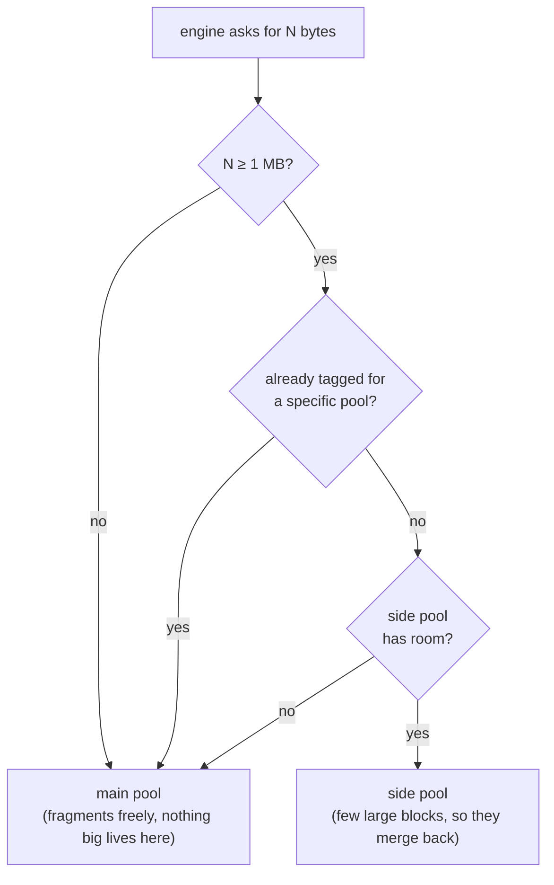

# lyrium

A proxy `d3d9.dll` for Dragon Age: Origins that stops the memory exhaustion behind
late-session texture flickering, missing scenery, and crashes.

## Credits

- **Nathan Baggs** — [nathan-baggs/mandrel](https://github.com/nathan-baggs/mandrel).
  The original research identifying the problem.
- **Matthew (adarec1994)** — [eluvian](https://github.com/adarec1994/eluvian).
  The implementation this is forked from. Texture relocation and the startup pool
  patch are both his.

## Installing

**Patch `DAOrigins.exe` for 4 GB first if you have not already.** The game is
32-bit and ships limited to 2 GB of address space; the patch lifts that to 4 GB on
any 64-bit Windows. lyrium works either way, but on a 2 GB executable it has to
share out a much smaller budget, and a heavy texture list will run out of address
space no matter what lyrium does with the pools. Any of the usual 4 GB patchers
will do it — it sets one flag in the executable header.

lyrium reads that flag and tells you which it found: the log line at startup says
`image: large_address_aware=true` or `false`, and the overlay says so too.

Drop `d3d9.dll` next to `DAOrigins.exe`, in `bin_ship`, and put a `lyrium.ini`
beside it:

```ini
[lyrium]
main_pool_mb=1024
side_pool_mb=945
overlay=1
logging=1
```

The same file works whether or not you have run a 4 GB patcher. lyrium reads the
LAA flag out of the executable's header: on a 4 GB image the side pool is added on
top of the budget, and on a stock 2 GB one the figures are clamped to a
configuration that fits (768 MB of pools, split 425/288). You do not have to know
which you have. `include/lyrium/config_parse.h` lists every key.

**Run in borderless windowed mode.** Alt-tabbing out of fullscreen makes the game
rebuild the Direct3D device, and it has a long-standing crash in that path with
nothing to do with memory. A borderless window never loses the device.

If the game does not start, launch `bin_ship\DAOrigins.exe` directly rather than
through the launcher — `DAOriginsConfig.exe` crashes on modern hardware for
unrelated reasons and stops the chain before the game runs.

Optional: `overlay=1` gives a panel on Shift+F12, `logging=1` writes to
`lyrium_logs/`.

## What goes wrong, and where

The game is 32-bit, so it has 2 GB of address space (4 GB with the LAA patch).
**Two different things fragment, at two different levels**, and either one alone
will break a session.

```
LEVEL 1 — the address space
┌──────────────────────────────────────────────────────────────────────┐
│ exe │ dlls │ Strings │   MAIN POOL   │  SIDE POOL  │ textures │ free  │
└──────────────────────────────────────────────────────────────────────┘
                            │
                            │  the pool is one single reservation.
                            │  Windows never looks inside it.
                            ▼
LEVEL 2 — inside the main pool
      ┌────────────────────────────────────────────┐
      │▓▓▓ ▓ ▓▓▓░░░░░░░░░░░░░░░░░▓▓░░░░░░░▓ ▓▓░░░░│
      └────────────────────────────────────────────┘
       ▓ = ~1.4 million small blocks that never move
```

**Level 1** is chewed up by managed textures. Each keeps a full CPU-side copy in
the address space, and every copy over 508 KB becomes its own reservation. They
turn over constantly at varying sizes until no unbroken block is left.

**Level 2** is chewed up by the engine's own long-lived small allocations. They sit
scattered through the pool like pillars, and the largest unbroken gap only ever
shrinks — one measured session handed back 330 MB without the biggest gap growing
by a single byte.

The engine periodically needs **71.6 MB in one unbroken piece**. When that no
longer fits, it does not fail and does not complain — it silently skips loading the
asset. That is the empty Denerim market and the cutscene that never fires, and it
is invisible to every error counter because nothing was ever attempted.

## What lyrium does

**For level 1** it creates eligible textures in `D3DPOOL_DEFAULT`, which has no
CPU-side copy, and hands the engine a temporary pagefile-backed buffer when it
locks one. The duplicate is never made rather than cleaned up afterwards.

**For level 2** it builds a second heap — using the engine's own allocator class,
registered in a slot the engine leaves empty — and routes every allocation of 1 MB
or more into it.



The side pool recovers where the main pool cannot: its largest run has been
measured going 944.9 -> 803.9 -> 850.4 MB across a session, and 62 -> 97.4 MB on a
smaller arena. With tens of blocks rather than a million, a freed block's
neighbours are usually free too, so they merge back.

This does **not** stop the main pool fragmenting — it fragments exactly as much as
before. It stops that mattering, because the only thing that needed a big unbroken
run no longer lives there. Measured on a 2 GB image, same route, same total memory:

| | without the side pool | with it |
|---|---|---|
| largest unbroken gap in the main pool | 73 MB | 209 MB |
| largest single thing it must still fit | 71.6 MB | under 1 MB |
| margin | **1.02×** | **~209×** |

A bounded eviction path also exists as a backstop; it does not fire on a correctly
configured install.

**[`docs/architecture.html`](docs/architecture.html)** covers the same ground with
proper diagrams — the two levels drawn to scale, the largest-gap curve with and
without the side pool, the routing rule, and which component acts at which level.
GitHub shows HTML as source, so download it and open it locally, or view it through
[htmlpreview](https://htmlpreview.github.io/?https://github.com/toeofcharmander/lyrium/blob/main/docs/architecture.html).

## Sizing

The numbers above are for a 2 GB executable, where every megabyte is contested:

```
strings  55 MB   fixed, the engine's own, cannot be changed
main    425 MB   needs capacity only  (peak use measured at 307 MB)
side    288 MB   needs capacity AND a 71.6 MB clear run
        ───────
        768 MB   total, proven; 960 MB froze during a map load
```

On a 4 GB executable there is a second 2 GB that no session has ever touched, so
the side pool is free — it is added on top rather than taken out of the budget.
The recommended figures are deliberately generous, because heavy texture mod loads
are exactly the case a tight arena would fail on and there is nothing to spend the
space on otherwise:

```
strings   55 MB
main     969 MB
side     945 MB
        ────────
        1969 MB   run clean, and the only configuration ever observed to place
                  an allocation above the 2 GB line at all
```

That costs roughly 1.9 GB of committed memory, most of it never touched — the
engine commits its pool up front and so does the side pool. On a machine with 16 GB
that is free; on 8 GB with other things running it is worth knowing about, and
`side_pool_mb=512` still leaves 7x the largest working set ever measured.

`main_pool_mb` is a **budget**, not a pool size: the engine takes a fixed 55 MB off
the top for its string pool and asks for the rest. If that request will not fit it
retries 1 MB smaller until it does, so the pool can quietly end up smaller than you
asked for. The mod reports what it actually got.

You should not need to tune any of this. If you do, `overlay=1` shows the largest
clear run in each of the three arenas against what each must still fit, which is
the only number that decides whether content gets dropped.

## Building

Both configurations are 32-bit. The DLL needs i686 MinGW-w64 GCC 14 or newer; the
tests build as native 32-bit Linux binaries.

```
cmake --preset dll-win32     && cmake --build --preset dll-win32
cmake --preset tests-linux32 && cmake --build --preset tests-linux32 && ctest --preset tests-linux32
```
