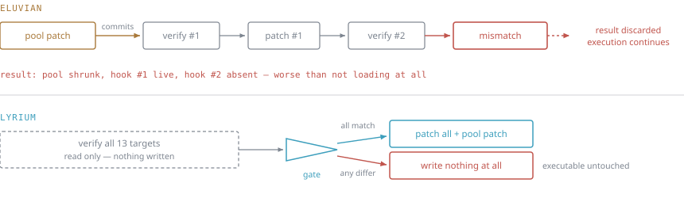
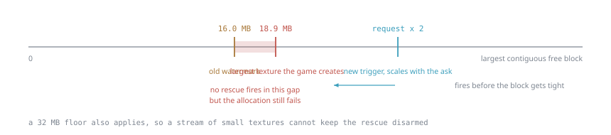
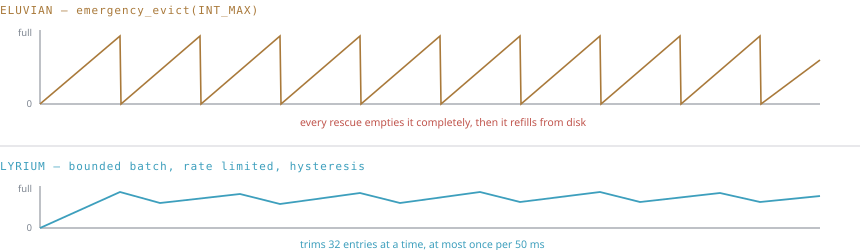
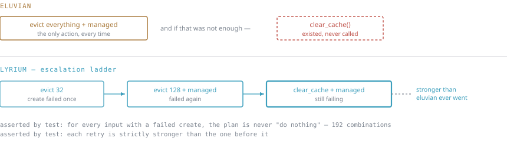

# What changed from eluvian, and why bounded eviction is the safer one

The technique that fixes the crash is inherited and unchanged: relocating managed
textures to the `DEFAULT` pool and backing their CPU-side copy with a
pagefile-backed file mapping that is only mapped during a lock. That design is
eluvian's, it is right, and it stays.

What was rewritten is everything that decides *when* things run. The case for the
new behaviour being safer rests on a worst case that is **stronger**, not weaker,
than what it replaced.

## 1. Installing the hooks

Both versions patch fixed addresses in `daorigins.exe`. The difference is what
happens when the game build does not match.

Before, the pool patch committed in `DllMain` before any hook was attempted, and
each hook's install result was discarded. A mismatched build therefore ran with a
rewritten allocator sizing constant and no compensating hooks — strictly worse
than not loading the mod at all.

Now a single read-only pass gates everything, the pool patch included. One
mismatch and the executable is left exactly as found, with the differing byte
named in the log.

## 2. When eviction fires

The old trigger was a fixed 16 MB watermark. The game creates a single 18.90 MB
texture. With 17 MB free the watermark was clear, so no rescue ran — and that
allocation failed anyway. **The threshold sat below the thing it was protecting.**

The trigger now scales with the size actually being requested, because what
decides success is whether one contiguous block can hold *this* allocation, not
whether some constant was cleared. A 32 MB floor also applies, so a stream of
small textures cannot keep the rescue disarmed while the address space collapses.

## 3. What eviction does when it fires

The old rescue called `emergency_evict(INT_MAX)` — the API takes a bound and the
caller declined it — then evicted all managed resources on top, on every firing,
with no rate limit. During streaming-heavy moments like cutscenes and area
transitions that fires repeatedly, and everything discarded has to be re-read from
disk and re-decoded. That is the stutter.

The new policy trims a bounded batch, at most once per 50 ms, with hysteresis so
it cannot oscillate.

## 4. Why bounded is not weaker

This is the part the safety argument rests on. Evicting less could plausibly mean
failing to reclaim enough, so the escalation was built to make that impossible,
and two properties are asserted directly rather than argued:

- **A failed create always produces an action.** Swept across attempt count,
  headroom, pending queue depth and cache availability, with the rate limit set
  maximally hostile — 192 combinations, all required to act.
- **Each retry is strictly stronger than the last**, terminating in a full cache
  clear plus managed eviction.

That last step is the crux. The old code *contained* `clear_cache()` and never
once called it. So the worst case of the new policy is stronger than the old
policy's normal case.

## Everything else

| Area | eluvian | lyrium |
|---|---|---|
| Texture relocation | *unchanged — inherited, and the reason the fix works at all* ||
| Pool decision | Inline in the hook, reachable only through four globals | Pure function, full truth table under test |
| Accounting | Three parallel systems that disagreed; totals ratcheted upward forever | One ledger; every counter derived from one record map |
| Texture lifetime | A dying texture could be resurrected mid-destruction; binding handed out a pointer that could be freed underneath it | Refcount that cannot be lifted off zero; binding transfers a reference |
| Mip validity | Bit-packed flags written outside the lock — two threads could lose an update | Atomic bitmask; the race is unrepresentable |
| Process exit | Destructors joined threads the OS had already killed, under the loader lock | Nothing static is destroyed; the log is sealed explicitly |
| Diagnosis | The address-space walk logged nothing; hook mismatches computed a report and discarded it | Both logged; a session that ended normally says so |
| Tests | None | 19 suites, run as 32-bit binaries so pointer width matches production |

## Why this should not cause more crashes

In descending order of weight:

1. **The ladder ends stronger.** If the new policy is ever wrong about how much
   to evict, it escalates to a full cache clear plus managed eviction — which the
   old code never reached. The failure mode of bounding is, at worst, doing what
   eluvian always did.
2. **The trigger fires earlier where it matters.** The old watermark could not
   prevent the very failure it existed for. Scaling with the request closes that
   gap rather than widening it.
3. **Failure is fail-safe.** A game build that does not match leaves the
   executable completely untouched.
4. **Three memory-safety bugs are gone.** A resurrected texture, a freed pointer
   handed to the driver, and a torn write across mip levels each corrupt rather
   than miscount. All three lived in the device-reset path, which is where this
   mod historically broke.
5. **There is a way back.** `rescue_unbounded=1` restores the old unbounded
   behaviour without a rebuild.

## Verification

All ten engine hooks install at their preferred addresses with `base_delta == 0`,
so the SHA-256 body check actually runs. Six device resets with texture accounting
intact across every one. Zero create failures across 1,200+ textures. The eviction
path itself has been exercised on both a 2 GB and a 4 GB install under heavy mod
load.

The original diagnosis is Nathan Baggs' (`nathan-baggs/mandrel`) and the core
implementation is eluvian's (`adarec1994/eluvian`); see the README.
